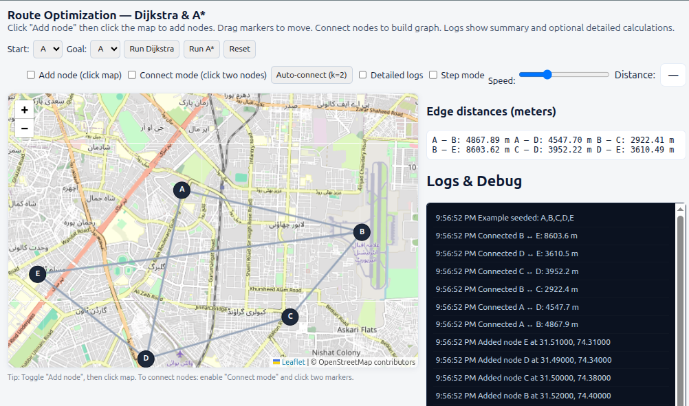

# 🗺️ Data Structures Route Optimizer

An interactive educational tool for visualizing **Graph Algorithms** (Dijkstra & A\*) on real-world maps using **Leaflet.js**. Perfect for students, developers, and computer science enthusiasts.



## ✨ Features

### 🗺️ **Interactive Map Interface**

- Add nodes by clicking on the map
- Drag & drop markers to adjust positions
- Connect nodes to build custom graphs
- Real-time distance calculations using Haversine formula

### ⚡ **Algorithms Visualization**

- **Dijkstra's Algorithm** - Classic shortest path algorithm
- **A\* Search Algorithm** - Heuristic-based optimization
- Step-by-step execution with detailed logs
- Visual path highlighting with different colors

### 📊 **Learning Tools**

- Structured logging system (summary + detailed modes)
- Edge distance display in real-time
- Node adjacency list visualization
- Auto-connect nearest neighbors feature

### 🎮 **User Controls**

- Start/Goal node selection
- Step-by-step execution mode
- Adjustable animation speed
- Toggle between detailed/summary logs

## 🛠️ Technologies Used

- **Frontend**: HTML5, CSS3, JavaScript (ES6+)
- **Mapping**: [Leaflet.js](https://leafletjs.com/) + OpenStreetMap
- **Algorithms**: Dijkstra, A\* with Priority Queue
- **Styling**: CSS Grid/Flexbox, Custom CSS
- **Math**: Haversine formula for distance calculation

## 📦 Usage

### Option 1: Run Locally

```bash
# Clone the repository
git clone https://github.com/farrukh-ali-khan/route-optimization-visualizer.git

# Navigate to project directory
cd data-structures-route-optimizer

# Open index.html in browser
open index.html
```
